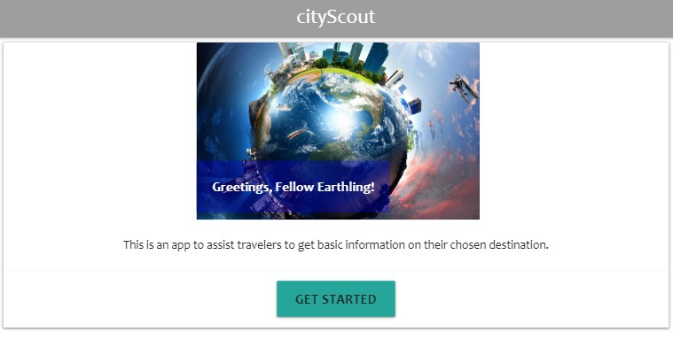
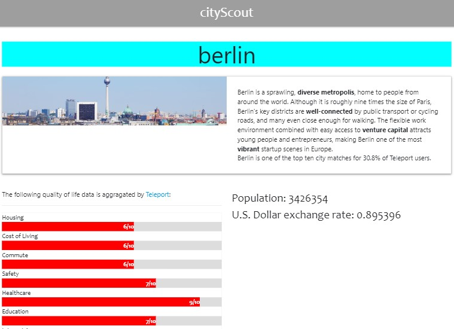

# City Scout

**Description**

City Scout is a web application that allows a user to get basic information about a city. The user first chooses a continent they are interested in and then they can choose from a list of countries. When the user selects a country, a list of the ten most populour cities from that country. When they choose a city, a page is rendered that displays basic information about the city such as: population, currency exchange, an image of the city, and 8 charts indicating how the city ranks in various categories like education and cost of living.

**Motivation**

Originally, City Scout started as a currency exchange application called "Travel Rich", which was aimed at helping travelers find the best places to travel based on cost and exchange. However, we realized that travelers need more than just an exchange rate when deciding what places they want to visit, so we changed out application to provide people with a set of basic information about a place they may be interested in visiting.

**User Story**

Given that I am someone interested in traveling around the world, when I identify a city of interest, then I want to get some information about that city.

**Build status**

The build status is complete.

**Code style**

The application is written in JavaScript and uses the jQuery library for traversing the DOM.

**Screenshots**




**Code Example**

```javascript
//This function renders a list of the ten most populous cities from the country that the user selects in the country drope down menu
function getCityList(countryId) {
  var citySearchApi = {
    async: true,
    crossDomain: true,
    url:
      "https://wft-geo-db.p.rapidapi.com/v1/geo/cities?limit=10&countryIds=" +
      countryId +
      "&sort=-population",
    method: "GET",
    headers: {
      "x-rapidapi-host": "wft-geo-db.p.rapidapi.com",
      "x-rapidapi-key": "6fa73b7e3dmsh2c5c461c7d26929p191785jsne3190cf9f4b1"
    }
  };
  console.log("the city serach country id is it working", chosenCountryId);
  $.ajax(citySearchApi).done(function(response) {
    console.log("this is the big response hreeeeee", response);
    var cityList = $("<div>");
    cityList.attr("aria-labelledby", "dropdownMenuButton");
    cityList.attr("class", "dropdown-menu");
    cityList.attr("id", "dropdown-menu-countries");
    for (var i = 0; i < response.data.length; i++) {
      console.log(i);
      var city = $("<a href='#'>" + response.data[i].city + "</a>");
      city.attr("class", "dropdown-item city-drop");
      city.attr("data-name", response.data[i].city);
      console.log(city);
      cityList.append(city);
    }
    var Cities = "Cities";
    var cityBtn = dropDownBtn(Cities);
    $("#city").append(cityBtn);
    $("#city").append(cityList);
  });
}
```

**Installation**

No installation necessary. Project is hosted here: https://mark-bernstein.github.io/cityScout/
